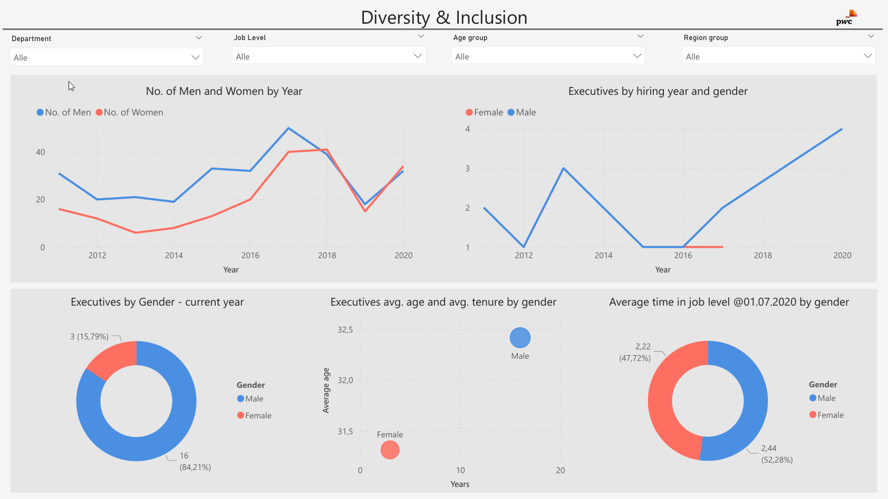
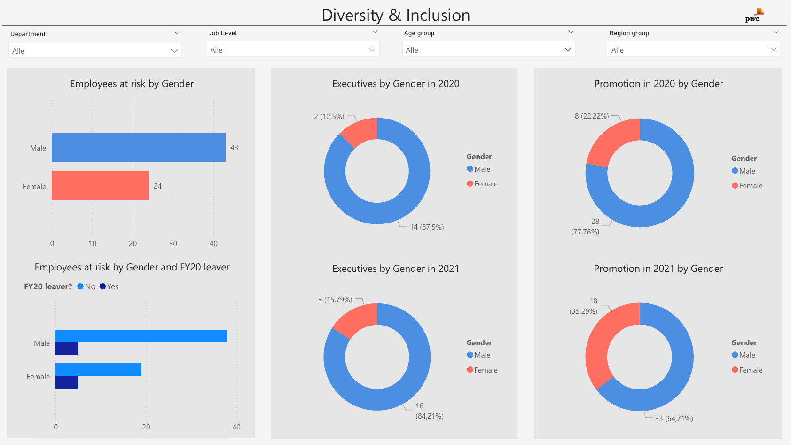

## **1. Project Title** 
**Diversity & Inclusion Dashboard Analysis**  

## **2. Objective or Problem Statement**
- **Objective:**
  The goal of this project was to analyze gender diversity trends across departments, job levels, and regions over time to provide actionable insights for improving diversity and inclusion initiatives.

- **Problem Statement:** 
  How has gender representation evolved over the years, and what insights can be derived to inform leadership decisions on diversity?

## **3. Data Source**
 
The dataset included employee demographics such as gender, age group, job level, department, and hiring date from 2012 to 2020.

## **4. Tools and Techniques**

  - **Tools:** Power BI for dashboard creation.
  - **Techniques:** Data cleaning, trend analysis, filtering by department/job level/region group.  
  *“Power BI was used to create an interactive dashboard with slicers for filtering data by department, job level, age group, and region.”*

## **5. Approach**

1. **Data Cleaning:** Removed duplicates and handled missing values.
2. **Exploratory Analysis:** Identified trends in gender representation over time.
3. **Visualization Design:** Created line charts for trends, pie charts for distribution by gender, and scatter plots for executive-level analysis.
4. **Interactivity:** Added slicers for dynamic filtering based on user preferences.

## **6. Key Insights**

1. **Gender Trends:**
   - The number of women in executive positions steadily increased from 2016 to 2020.
   - Men have consistently held a higher percentage of executive roles compared to women.
2. **Average Age and Tenure:**
   - Female executives have slightly lower average tenure compared to male executives.
3. **Diversity Distribution:**
   - Certain departments showed higher gender diversity than others.

**Page 1**

**Page 2**

## **7. Impact**

- This dashboard enables leadership teams to monitor diversity metrics across departments and regions dynamically.
- Insights from this analysis can inform recruitment strategies aimed at improving gender representation in executive roles.

## **8. Challenges Faced**
Handling inconsistent data formats required advanced data cleaning techniques in Power BI.

## **9. Reflection**

This project enhanced my ability to create dynamic dashboards with intuitive filtering options while improving my understanding of diversity metrics.

## **10. Link to Dashboard**

